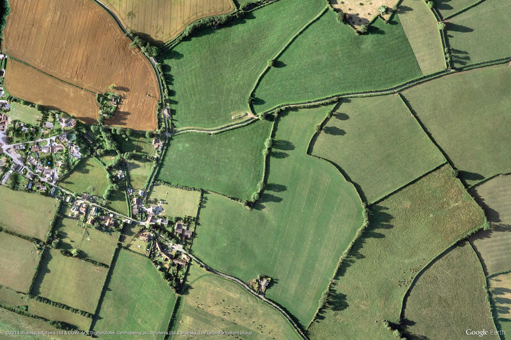

.. image:: https://img.shields.io/dub/l/vibe-d.svg
  :target: LICENSE.md
  :align: left

iclouder:
----------------

    markdown document's local image uploader and links replacer

一、简介(description)
----------------------

实现markdown文档中的本地图片自动上传并自动替换图片链接。

二、支持说明(support description)
-------------------------------

**image storage backend** : qiniu

**python** : >=3.4

**platforms** : Linux(tested), windows(not testing), MacOs(not testing)

**version** : 0.0.1

三、安装(installation)
---------------------

.. code-block:: bash

    $ pip install iclouder

四、用法(usage)
------------

1. 创建配置(Create the configuration)
^^^^^^^^^^^^^^^^^^^^^^^^^^^^^^^^^^^^^

.. code-block:: bash

    $ iclouder config create

执行上面命令后，按照提示输入相关配置信息(After the execution of above code, type the related information according to prompt).

2. 上传并替换图片路径(upload and replace local image)
^^^^^^^^^^^^^^^^^^^^^^^^^^^^^^^^^^^^^^^^^^^^^^^^^^^^^

.. code-block:: bash

   $ iclouder replace --in-file input.md --out-file out.md

or

.. code-block:: bash

    $ iclouder replace --in-file input.md % 在原文件上进行修改(modify on the original files)

For example
替换前(Before replacement)

.. code-block:: markdown

    图像上传(image uploading)
    示例图像，示例图像(image examples)
    
    

替换后(After replacement)

.. code-block:: markdown

    图像上传(image uploading)
    示例图像，示例图像(image examples)
    
     
    

五、额外功能(Extra)
----------------

**iclouder** 除了能够上传本地图片并替换图片链接之外，还可以对图片打水印.

1.文字水印(watermark text)
^^^^^^^^^^^^^^^^^^^^^^^^^^^^^^

**(1)基本语法:**

水印相关信息通过query string 的方式添加在图片链接后面

.. code-block:: markdown

   

**(2)水印参数说明:**

:water_mark:
        水印文字，必填

:font:
        文字字体，默认为宋体，可选值请参看 `这里 <https://developer.qiniu.com/dora/kb/1379/image-and-video-text-watermarking-support-font-list>`_.

:color:
        水印文字颜色，默认为white，可以是颜色名称(例red)或者十六进制(例如#ffffff).

:t_dissolve:
        透明度，默认为100，可选值为0-100,100为完全不透明.

:t_dx:
        横边距，默认为10，单位为像素(px)

:t_dy:
        纵边距，默认为10，单位为像素(px)

:fontsize:
        文字大小，默认为500，单位为缇，等于1/20磅，参考DPI为72

:t_gravity:
        水印位置，默认为SouthEast，具体查看 `这里 <https://developer.qiniu.com/dora/manual/1316/image-watermarking-processing-watermark#watermark-anchor-spec>`_

**(3)例子(examples):**

.. code-block:: markdown

    

 

        

替换后(After replacement)

.. code-block:: markdown

   

.. image:: http://oz7mpt8xg.bkt.clouddn.com/f744ab38c7730ab3e82ed46382c709c3a6e5154aa4a537854e1c58ef85e5751c.jpg?watermark/2/text/QOmSoumTgeS-oA==/font/5a6L5L2T/fill/d2hpdGU=/fontsize/500/dissolve/100/dx/10/dy/10/gravity/SouthEast

2.图片水印(watermark image)
^^^^^^^^^^^^^^^^^^^^^^^^^^^^^^

**(1)基本语法:**

水印相关信息通过query string 的方式添加在图片链接后面

.. code-block:: markdown

   

**(2)水印参数说明:**

:water_image:
        水印图片链接，必填，可以是本地图片也是网络图片

:i_dissolve:
        透明度，默认为100，可选值为0-100,100为完全不透明.

:i_dx:
        横边距，默认为10，单位为像素(px)

:i_dy:
        纵边距，默认为10，单位为像素(px)

:i_gravity:
        水印位置，默认为SouthEast，具体查看 `这里 <https://developer.qiniu.com/dora/manual/1316/image-watermarking-processing-watermark#watermark-anchor-spec>`_

:ws:
        水印图片自适应原图的短边比例，默认值为0.1，ws的取值范围为0-1。具体是指水印图片保持原比例，并短边缩放到原图短边*ws

:wst:
        水印图片自适应原图的类型，取值0、1、2、3分别表示为自适应原图的短边、长边、宽、高，默认值为0
        例如：原图大小为250x250，水印图片大小为91x61，如果ws=1，那么最终水印图片的大小为：372x250。

**(3)例子(examples):**

.. code-block:: markdown

    

 

        

替换后(After replacement)

.. code-block:: markdown

        

.. image:: http://oz7mpt8xg.bkt.clouddn.com/00ee861219775104ad2a1c40f40a616bd761a457fb02f854cc3466c62b30fe6c.jpg?watermark/1/image/aHR0cDovL296N21wdDh4Zy5ia3QuY2xvdWRkbi5jb20vYTdhNGY1ZDA4NTNhNDkzNDdiY2E5ZGZjNjQwYzNiZDMzZmZhY2Y3MDg0ODk2MGUwNzJhYzlhMzNhNDEyMDNkZC5qcGc=/dissolve/100/dx/10/dy/10/gravity/SouthEast/ws/0.2/wst/0

3. 图片+文字水印(watermark image and text)
^^^^^^^^^^^^^^^^^^^^^^^^^^^^^^^^^^^^^^^^^^^^^^^^

只需要将图片和文字水印的参数拼接起来即可

**(1)例子(examples):**

.. code-block:: markdown

    

替换后(After replacement)

.. code-block:: markdown

        

.. image:: http://oz7mpt8xg.bkt.clouddn.com/5af9b77318c16af127f9e61fbed6b38c80e83d3244c1999ea2edff293d90f095.jpg?watermark/3/text/QOaWh-Wtl-awtOWNsA==/font/5a6L5L2T/fill/IzIyMzNGRg==/fontsize/800/dissolve/100/dx/10/dy/10/gravity/NorthWest/image/aHR0cDovL296N21wdDh4Zy5ia3QuY2xvdWRkbi5jb20vNTk4N2Q4MThmYTY4OWU3ZGRlMTk4NDhlYjg0MzE3YWFhYWJkOTc0MGI0ZmVjZmE4NzQ2OTZhMzgyYmE0MzYwMi5qcGc=/dissolve/100/dx/10/dy/10/gravity/SouthEast/ws/0.2/wst/0

六、命令和相关参数details
---------------------------

1. config(配置)
^^^^^^^^^^^^

**(1)创建配置(create):**

`创建默认配置:`

.. code-block:: bash

    $ iclouder config create

`指定配置配置文件:`

.. code-block:: bash
    $ iclouder config create --with-config filename
    $ % or 
    $ iclouder config create --with_config filename
    $ % or
    $ iclouder --with-config filename config create 

**(2)打印和备份配置(print):**

`打印配置:`

.. code-block:: bash

     $ iclouder config print
     $ % or
     $ iclouder config print --with-config filename %打印指定的配置文件

`备份配置;`

.. code-block:: bash
     
     $ iclouder config print --to-file backup_file
     $ % or 备份指定的配置文件
     $ iclouder config print --to-file backup_file --with-config filename 
 

`同时打印和备份配置`

.. code-block:: bash
        
     $ % 只需要指定参数--tee 即可
     $ iclouder config print --to-file backup_file --tee

2. replace(上传并替换图片)
^^^^^^^^^^^^^^^^^^^^^^^^^^^^^

**(1)替换markdown文档中的图片(replace):**

.. code-block:: bash

     $ iclouder replace --in-file input.md --out-file output.md
     $ % or 在原文件进行修改
     $ iclouder replace --in-file input.md
     $ % or 指定配置文件
     $ iclouder replace --in-file input.md --with-config config_file
 

LICENSE
-------------------

`MIT LICENSE <LICENSE.md>`_
